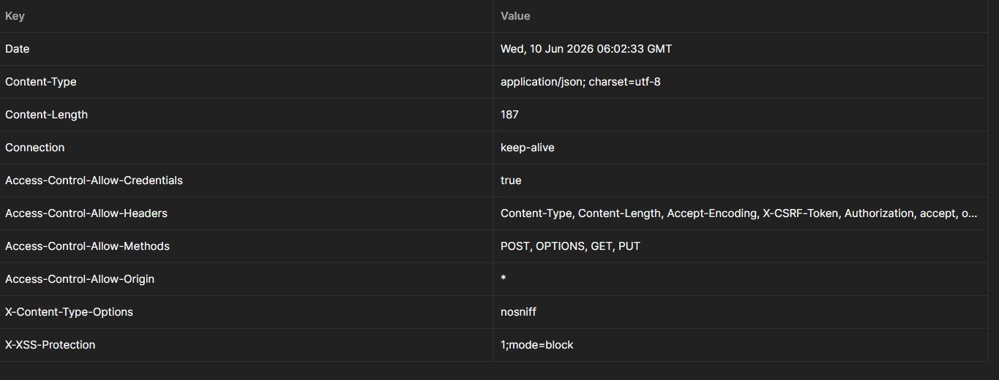
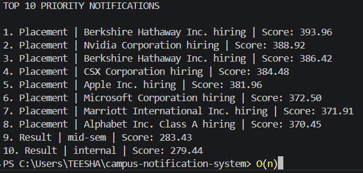
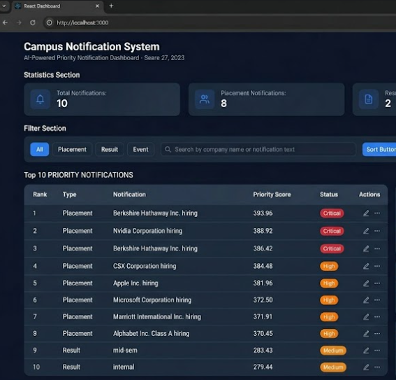
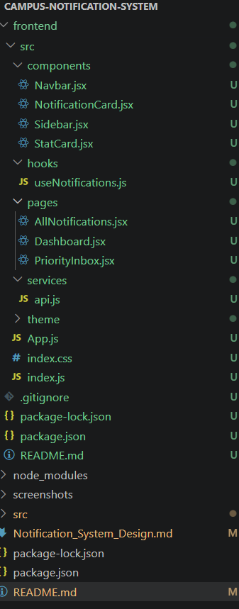

# Campus Notification System

## Overview

The Campus Notification System is designed to fetch notifications from a secured API, calculate their priority, and display the most important notifications for students. The system ensures that critical notifications such as placement opportunities are shown before less urgent notifications.

The application authenticates using the provided credentials, retrieves notifications from the server, calculates a priority score for every notification, and maintains only the highest priority notifications.

---

## Priority Hierarchy

Notifications are prioritized in the following order:

1. Placement
2. Result
3. Event

This hierarchy ensures that career-related opportunities receive the highest visibility, followed by academic results and then campus events.

---

## Features

* Secure API Authentication
* Notification Retrieval from Remote Server
* Priority Score Calculation
* Top 10 Notification Ranking
* Efficient Notification Processing
* Optimized Data Structure Implementation
* Simple and Scalable Architecture

---

## Approach

Initially, all notifications can be sorted using a standard sorting algorithm.

### Array Sorting Approach

The straightforward solution is to:

1. Fetch all notifications.
2. Calculate priority scores.
3. Sort the complete array in descending order.
4. Select the first 10 notifications.

Although simple, this approach requires sorting the entire dataset every time.

**Time Complexity**

```text
O(n log n)
```

For large numbers of notifications, this becomes inefficient because the system repeatedly sorts notifications that may never appear in the final Top 10 list.

---

## Optimized Approach Using Min Heap

To improve efficiency, a fixed-size Min Heap of capacity 10 is used.

### Working Process

1. Fetch notifications from the API.
2. Calculate a priority score for each notification.
3. Insert notifications into the Min Heap until it contains 10 elements.
4. For every new notification:

   * Compare it with the minimum priority notification currently in the heap.
   * If the new notification has a higher score, remove the minimum element.
   * Insert the new notification into the heap.
5. Continue until all notifications are processed.
6. Extract and display the Top 10 notifications.

This method ensures that only the most important notifications remain in memory.

---

## Time Complexity Analysis

Min Heap operations require:

```text
Insertion  -> O(log 10)
Deletion   -> O(log 10)
```

Since the heap size remains fixed at 10:

```text
O(log 10) ≈ O(1)
```

Overall Complexity:

```text
O(n log 10)
≈ O(n)
```

This is significantly more efficient than sorting the entire dataset and is better suited for production-scale notification systems.

---

## Sample Output

```text
TOP 10 PRIORITY NOTIFICATIONS

1. Placement | Berkshire Hathaway Inc. hiring | Score: 393.96
2. Placement | Nvidia Corporation hiring | Score: 388.92
3. Placement | Berkshire Hathaway Inc. hiring | Score: 386.42
4. Placement | CSX Corporation hiring | Score: 384.48
5. Placement | Apple Inc. hiring | Score: 381.96
6. Placement | Microsoft Corporation hiring | Score: 372.50
7. Placement | Marriott International Inc. hiring | Score: 371.91
8. Placement | Alphabet Inc. Class A hiring | Score: 370.45
9. Result | mid-sem | Score: 283.43
10. Result | internal | Score: 279.44
```

---

## Project Structure

```text
src
│
├── index.js
├── services
│
├── components
│
├── priorityCalculator.js
├── minHeap.js
└── topNotifications.js
```

---

## Screenshots

### Application Screenshots

Images are provided below showing the implementation, execution flow, terminal output, notification processing, and final results.

<!-- <p align="center">
  
</p> -->

<p align="center">
  
</p>

<p align="center">
  
</p>

<p align="center">
  
</p>

<!-- <p align="center">
  
</p> -->

---

## Learning Outcomes

* Understanding API Authentication
* Working with External REST APIs
* Designing Priority-Based Systems
* Implementing Heap Data Structures
* Optimizing Time Complexity
* Handling Real-Time Notifications
* Writing Scalable JavaScript Applications

---

## Conclusion

The Campus Notification System successfully prioritizes notifications by combining business logic with an optimized Min Heap implementation. Instead of repeatedly sorting complete datasets, the application efficiently maintains only the most important notifications, reducing processing time while improving scalability and performance.
